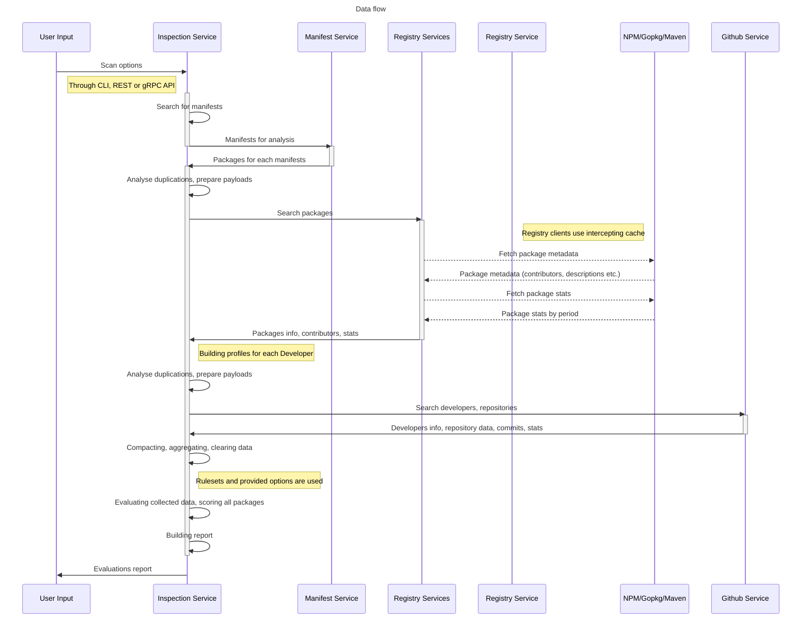

# Application components

1. [InspectionService](../internal/service/inspect_service/service.go)
2. [ManifestService](../internal/service/manifest_service/service.go)
3. [RegistryServices](../internal/service/registry_service/service.go)
    - NPM
    - Golang
4. [GitHubService](../internal/service/github_service/service.go)

